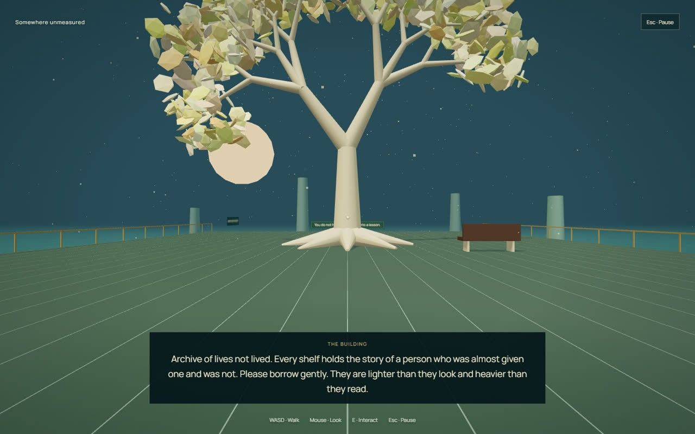
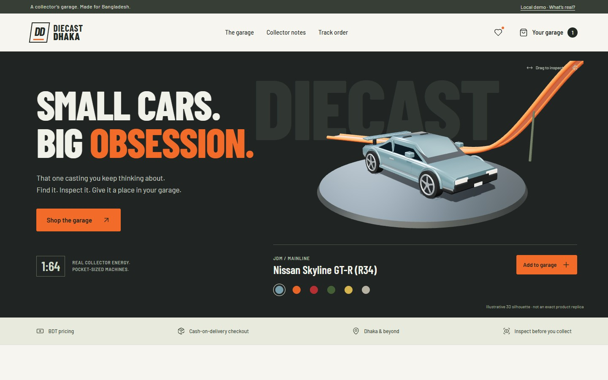
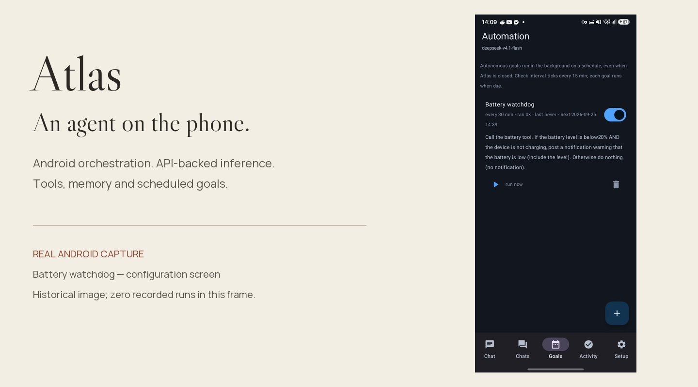

# Md. Sadman Bin Masud

**Interactive worlds. Considered interfaces. Inspectable engineering.**

EECE student at **MIST, Dhaka**. I build games, Android agent tools, web experiences and embedded-system projects.

**[Explore the portfolio](https://mdsadman2004.github.io/)** · **[Games](#games)** · **[Interfaces](#interfaces)** · **[Android](#android)**

## Games

### Grid Protocol — enter the grid

Transforming vehicles, neon roads and flight in a Three.js grid-combat prototype.

**[Watch driving & flight](https://mdsadman2004.github.io/#grid-protocol)** · **[Explore the code](https://github.com/MdSadman2004/tron-ares)**

*Actual in-engine footage, staged with scripted inputs and a showcase camera. Local prototype capture, not a human playthrough. Film-inspired; not an official Tron product.*

### Sadman's Parable — a building with plans for you

A first-person psychological fable with branching routes, an unreliable narrator and places that should not exist.

**[Play in your browser](https://mdsadman2004.github.io/sadmans-parable/)** · **[Scene gallery](https://mdsadman2004.github.io/#sadmans-parable)** · **[Source & download](https://github.com/MdSadman2004/sadmans-parable)**

*Actual environment capture from the existing WebGL build. Unaffiliated homage; not affiliated with the creators or publishers of The Stanley Parable.*

## Interfaces

### Diecast Dhaka — a collector's garage

A 3D storefront built around inspection, casting selection and a car-to-cart interaction—not just a product grid.

**[Desktop & mobile views](https://mdsadman2004.github.io/#diecast-dhaka)** · **[Source & prototype release](https://github.com/MdSadman2004/Diecast-Dhaka)**

*Actual UI capture. Demonstration inventory and illustrative vehicle silhouettes; not a live shop or an exact product replica.*

## Android

### Atlas — an agent on the phone

Android-side orchestration, local tools, memory and scheduled goals. Language-model inference uses an external API.

**[Architecture & source](https://github.com/MdSadman2004/Atlas)** · **[Download releases](https://github.com/MdSadman2004/Atlas/releases)**

*Historical capture: a configured Battery watchdog goal with zero recorded runs, not evidence of successful background execution.*

## Beyond the screen

| Work | Explore |
| :-- | :-- |
| **Hermes Mobile** — Android companion for desktop sessions and operations | [Repository](https://github.com/MdSadman2004/hermes-mobile) |
| **Hybrid Solar–Grid** — microgrid dashboard, simulator and electronics references | [Repository](https://github.com/MdSadman2004/hybrid-solar-grid) |
| **Socratic Engine** — streamed thinking workspace and concept dictionary | [Repository](https://github.com/MdSadman2004/socratic-engine) |
| **Research & design studies** — source, recorded artifacts and their limitations | [Full directory](https://mdsadman2004.github.io/#directory) |

<strong>Browse the full project directory</strong>

## Project directory

Every public repository is included below. Each project README identifies its setup path, source entry points and limitations.

### Agents & tooling

| Repository | What is actually published |
| :-- | :-- |
| [Atlas](https://github.com/MdSadman2004/Atlas) | An Android agent with local tools, persistent memory, scheduled goals and API-backed inference. |
| [Hermes Mobile](https://github.com/MdSadman2004/hermes-mobile) | An Android control companion for desktop Hermes sessions, files, operations and terminal access. |
| [Socratic Engine](https://github.com/MdSadman2004/socratic-engine) | A Next.js thinking workspace with LangGraph routing, streamed replies and a concept dictionary. |
| [Hermes CLI Orchestrator](https://github.com/MdSadman2004/hermes-orchestrator) | Python integration scripts for dispatching external agent CLIs, checking artifact postconditions, sharing file-based memory, exporting MCP settings, and inspecting cron state. |
| [AgentForge Artifact Utilities](https://github.com/MdSadman2004/AgentForge) | Standard-library Python utilities for file hashing, artifact metadata, lightweight contract validation, and persistent change checks, with historical automation demo notes. |
| [Hermes Remote Evidence Archive](https://github.com/MdSadman2004/hermes-remote) | Archive of selected Hermes mobile and PC integration source text in source-evidence.json, with historical UI captures and protocol findings. Not a standalone backend or Android build. |
| [Hermes Projects](https://github.com/MdSadman2004/hermes-projects) | A historical umbrella snapshot containing an Android Hermes companion project. |

### Hardware

| Repository | What is actually published |
| :-- | :-- |
| [Hybrid Solar–Grid](https://github.com/MdSadman2004/hybrid-solar-grid) | A local microgrid dashboard, telemetry simulator, command service and electronics references. |
| [ZeroADC and CDM Research Artifacts](https://github.com/MdSadman2004/ZeroADC) | Research kernels and recorded artifacts for Zero-ADC event gating and Collatz deterministic recovery, including modeled energy comparisons, fixed-window AVR/Renode firmware, logs, and a validation dossier. |
| [Project Farcry ESP32 Car Prototype](https://github.com/MdSadman2004/ProjectFarcry) | ESP32 car-control sketch and Python/OpenCV face-following prototype using an Android IP Webcam stream, with separate Flask media/location receiver experiments. Bench prototype, not a validated rescue system. |
| [Hardware Visualizations](https://github.com/MdSadman2004/hardware-visualizations) | Browser-readable circuit drawings and an early load-shedding alert design proposal. |
| [Ultrasonic Distance Estimator](https://github.com/MdSadman2004/EECE-106) | A React coursework presentation for an Arduino ultrasonic-distance project. |

### Research & analysis

| Repository | What is actually published |
| :-- | :-- |
| [ILCI TinyML Initialization Research](https://github.com/MdSadman2004/ILCI) | Exploratory ATmega328P study of Collatz-derived neural-network initialization, with Arduino benchmark source, recorded CSV, plotting scripts, and a manuscript. Results need methodological review, not assumed reproduction. |
| [TerraTrace Deed Chain Demo](https://github.com/MdSadman2004/TerraTrace) | LangGraph and Pydantic deed-history demo with labeled text parsing, adjacent-owner checks, keyword covenant flags, and cosine ranking over three mock precedent records. Not legal advice. |
| [LexisClear Contract Review Demo](https://github.com/MdSadman2004/LexisClear) | LangGraph contract-review demo that parses sample text sections, applies hardcoded playbook phrase rules, and exports an HTML report with predefined replacement clauses. Not legal advice. |
| [Vanguard Emissions Report Demo](https://github.com/MdSadman2004/Vanguard) | LangGraph demo for reading a sample activity ledger, applying keyword scope labels and hardcoded emission factors, and exporting an HTML report. Not validated ESG compliance or carbon accounting. |
| [BP Local Monitor](https://github.com/MdSadman2004/bp-local-monitor) | Local Python blood-pressure logger with validated CSV readings, explicit classification rules, summary statistics, HTML dashboard generation, and agent JSON context. Not a medical device. |

### Creative web

| Repository | What is actually published |
| :-- | :-- |
| [Diecast Dhaka](https://github.com/MdSadman2004/Diecast-Dhaka) | A collector-focused 3D storefront prototype with demo inventory. |
| [Generative 3D Portfolio](https://github.com/MdSadman2004/portfolio-3d) | A React portfolio with a Three.js field, seeded canvas artwork and a Collatz explorer. |
| [Graphein](https://github.com/MdSadman2004/graphein) | A React studio landing page with motion, an ROI calculator and section-based navigation. |
| [Glade](https://github.com/MdSadman2004/Glade) | A multi-page studio website with Express routing and illustrative agent simulators. |
| [CNN Filter Atlas](https://github.com/MdSadman2004/frontend-designs) | A self-contained HTML visual guide to convolution filters and their mechanisms. |
| [Website Studies](https://github.com/MdSadman2004/WebsitesCollection) | Standalone HTML experiments spanning portfolios, landing pages and a small canvas game. |
| [AI Prompt Collection](https://github.com/MdSadman2004/ai-prompt-collection) | A small, browsable archive of image, cinematography and Arduino project prompts. |
| [Projects — Frontend Scaffold](https://github.com/MdSadman2004/Projects) | A partial Vite / React coursework scaffold whose referenced application source is missing. |

### Games

| Repository | What is actually published |
| :-- | :-- |
| [Sadman's Parable](https://github.com/MdSadman2004/sadmans-parable) | An offline first-person psychological fable with an unreliable narrator and branching endings. |
| [Grid Protocol](https://github.com/MdSadman2004/tron-ares) | A Three.js grid-combat prototype with transforming vehicles and an Android WebView wrapper. |

### Profile & directory

| Repository | What is actually published |
| :-- | :-- |
| [Md. Sadman Bin Masud](https://github.com/MdSadman2004/MdSadman2004) | AI-agent tools, Android applications, embedded-system projects and interactive worlds. |
| [Portfolio Hub](https://github.com/MdSadman2004/MdSadman2004.github.io) | A visual directory of public projects, organized into agents, hardware, research, web and games. |

## How I approach engineering

- **Rigor over hype.** Source, results and limitations should agree.
- **Keep the boundary visible.** A simulator is not a hardware test; a prototype is not a production service.
- **Make the work inspectable.** Document the real entry points, not an imagined architecture.

## Contact

For project discussions, open an issue in the relevant repository. This public page deliberately avoids publishing private contact details or device-pairing credentials.

## Scope & limitations

This profile is a directory, not independent certification of every project. Source-guide images are explanatory drawings. App and game captures are pre-existing project evidence; experimental outcomes should be read with their original conditions and baselines. Each repository documents its own license or absence of a repository-wide license grant.
